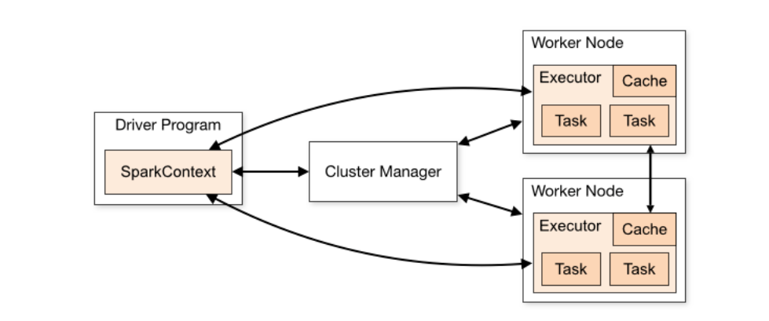
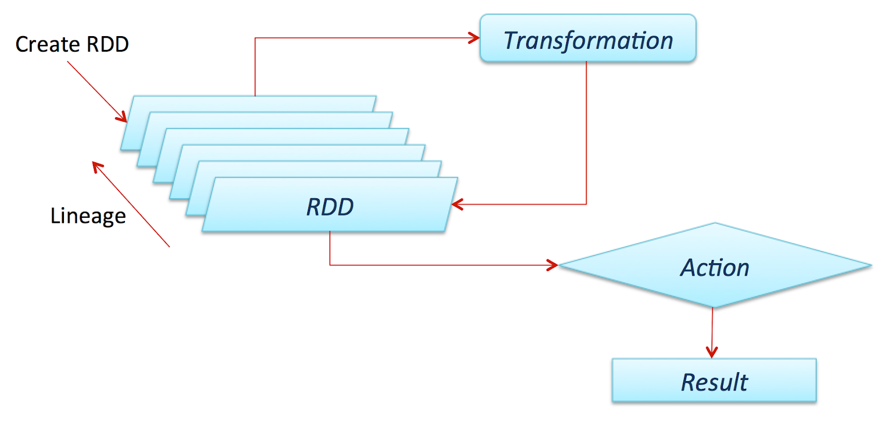

# Spark


## Cluster Mode Overview

[Cluster Mode Overview - Spark 3.3.2 Documentation](https://spark.apache.org/docs/latest/cluster-overview.html#cluster-manager-types)



A Spark cluster consists of a cluster manager and worker nodes.

The driver program is run on the client machine.

Cluster manager can be either Spark's own standalone cluster manager, YARN, or Kubernetes.


### Cluster Manager Types

* Standard (Spark's own manager)
* YARN
* Kubernetes

## RDD




* Distributed data analysis
* Impala is specific to one vendor's distribution
* The goal is to speed up jobs
    * Batches
    * Machine learning 
    * Interactive queries
* Concepts
    * Lazy evaluation
    * 
* Introduction
    * Driver program
        *  that runs the user’s main function and executes various parallel operations on a cluster
    * Cluster
    * Spark supports two types of shared variables: broadcast variables, which can be used to cache a value in memory on all nodes, and accumulators, which are variables that are only “added” to, such as counters and sums.
    * 
* PySparkSQL
    * SQL
        * Direct
        * APIs
    * Hive
* Resilient Distributed Dataset (RDD)
    * Spark revolves around the concept of a resilient distributed dataset (RDD), which is a fault-tolerant collection of elements that can be operated on in parallel.
    * There are two ways to create RDDs:
        * parallelizing an existing collection in your driver program
        * or referencing a dataset in an external storage system, such as a shared filesystem, HDFS, HBase, or any data source offering a Hadoop InputFormat.
    * RDD Operations
        * Transformations
            * map
            * filter
            * union
        * Actions
            * reduce
            * collect
            * saveAsTextFile

RDD stores in RAM.

Difference between using MapReduce in Hadoop and Spark's RDD:


* RDD stores the data (collection) in memory, but MapReduce reads and writes data constantly with a disk.
* RDDs are immutable.
* RDD Operations
    * [Transformations](https://spark.apache.org/docs/latest/rdd-programming-guide.html#transformations)
        * map
        * filter
        * union
    * [Actions](https://spark.apache.org/docs/latest/rdd-programming-guide.html#transformations)
        * reduce
        * collect
        * saveAsTextFile

Spark libraries

* SQL and DataFrames
    * [Functions](https://spark.apache.org/docs/3.3.2/sql-ref-functions.html)
        * Built-in
            * Scalar (array functions, map functions, …)
            * Aggregate-like
            * Generator
        * User-defined (UDF)
            * 
* Streaming
* MLib
* GraphX

Commercial distribution on cloud
- Databricks
- Cloudera

## Starting a driver app with PySpark

``` python
port = 3000 #Dashboard Port
``` 
[Spark config file](https://spark.apache.org/docs/latest/configuration.html)

spark_master = "spark://IP:PORT"
``` python
spark_master = "spark://mohsen-local:7077"

conf = (
    SparkConf()
    .set("spark.app.name", "AppName")
    .set("spark.master", spark_master)
    .set("spark.ui.port", str(port))
)

sc = SparkContext(conf=conf)
spark = SparkSession.builder.getOrCreate()
```

This driver app connects to a Spark cluster.